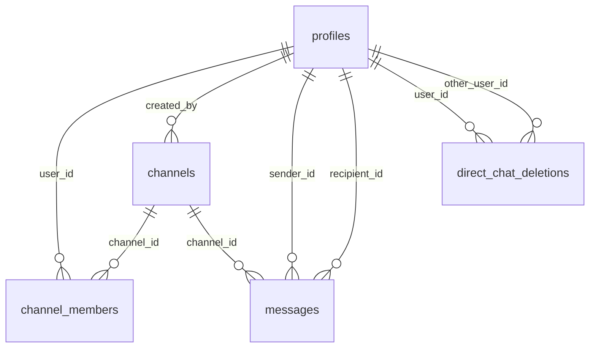

# DABubble 💬

<div align="center">
  <picture>
    <source media="(prefers-color-scheme: dark)" srcset="public/img/logo/logo_with_text_white.svg">
    <source media="(prefers-color-scheme: light)" srcset="public/img/logo/logo_with_text.svg">
    
  </picture>
  <p><em>A modern, high-performance real-time team chat in the style of Slack – built with Angular 21 and Supabase.</em></p>
</div>

---

[](https://angular.dev/)
[](https://supabase.com/)
[](https://www.typescriptlang.org/)

DABubble is an interactive web application for real-time team communication, inspired by Slack. The project was designed and implemented as a team project within the **Developer Akademie** program. It combines a modern frontend architecture based on Angular with a scalable Backend-as-a-Service (BaaS) infrastructure powered by Supabase.

---

## 🚀 Key Features

*   **Real-Time Messaging**: Send and receive messages in channels, direct messages (DMs), or thread replies without manual page reloads using Supabase Realtime Channels.
*   **Presence & Online Status**: Instant visibility of team members' online status (Online, Offline, Away) via Supabase Presence.
*   **Typing Indicators**: Real-time visual indicators when a chat partner is typing.
*   **Mentions & Autocomplete**: Quickly link team members using `@` and channels using `#` with interactive autocompletion during input.
*   **Rich Text & Emoji Integration**: Message input field supporting line breaks, mentions, and an integrated emoji picker (`ngx-emoji-mart`) with a history of recently used emojis.
*   **Message Interactions**: Add emoji reactions to messages, edit your own messages, or delete messages completely.
*   **Global Full-Text Search**: Find channels, message contents, and members quickly via an intelligent search bar.
*   **User Profiles**: Custom profiles including avatar selection (from predefined avatars or custom uploads) and status management.
*   **Secure Authentication**: Sign up and login via email/password or Google OAuth (Social Login), forgot password function, and password reset flows.
*   **Privacy (GDPR Compliant)**: Full account deletion via a dedicated Supabase Deno Edge Function. This cleans up all related data (memberships, reactions, channels) and deletes the authentication user.

---

## 🛠️ Tech Stack

### Frontend
*   **Framework**: Angular 21 (Standalone Components, Signals for reactive state management, Standalone Routing & Guards).
*   **Styling**: SCSS (structured styles, custom core CSS system with CSS variables, responsive layouts for mobile, tablet, and desktop).
*   **UI Library**: Angular Material & CDK (for modal dialogs, overlays, and accessibility).
*   **Utilities**: `@ctrl/ngx-emoji-mart` for emojis.

### Backend & Database
*   **Platform**: Supabase (PostgreSQL).
*   **Database**: Tables for profiles, channels, channel members, messages, and direct chat deletions.
*   **Realtime**: Postgres replication triggers to synchronize messages and presence information.
*   **Serverless**: Supabase Edge Functions (Deno/TypeScript) for administrative cleanup logic.

### Tooling & Testing
*   **Test Runner**: Vitest & jsdom (fast, modern unit tests for Angular components and services).
*   **Code Quality**: Prettier for consistent code formatting.
*   **Package Manager**: npm (v11+).

---

## 📁 Project Structure (Excerpt)

```text
DABubble/
├── supabase/                   # Supabase configuration & Edge Functions
│   ├── functions/              # Deno Edge Functions
│   │   └── delete-account/     # Edge Function for GDPR-compliant account deletion
│   └── migrations/             # SQL database migrations
├── src/
│   ├── app/
│   │   ├── components/         # Reusable UI components (Chat, Sidebar, Modals)
│   │   ├── guards/             # Route Guards (e.g., authGuard)
│   │   ├── interfaces/         # TypeScript Interfaces (Channel, Message, User)
│   │   ├── pages/              # Main pages (Login, Signup, Main Dashboard, Reset Password)
│   │   ├── services/           # Services for Backend, Realtime, Profile & Message handling
│   │   └── app.ts              # Root component of the app
│   ├── environments/           # Environment configurations (Supabase keys)
│   └── styles/                 # Global stylesheets & SCSS partials
├── vitest.config.ts            # Configuration for Vitest
└── angular.json                # Angular CLI configuration
```

---

## 💻 Getting Started (Local Installation)

### Prerequisites
Make sure you have the following software installed on your system:
*   [Node.js](https://nodejs.org/) (Version >= 20.x recommended)
*   [Angular CLI](https://angular.dev/tools/cli) (Version 21.x)
*   [Supabase CLI](https://supabase.com/docs/guides/cli) (optional)

### 1. Clone the Repository & Install Dependencies
```bash
git clone https://github.com/JensBaumannDev/DABubble.git
cd DABubble
npm install
```

### 2. Set up Environment Variables
Create or adjust the configuration file `src/environments/environment.ts` and enter your Supabase project credentials:
```typescript
export const environment = {
  supabaseUrl: 'YOUR_SUPABASE_URL',
  supabaseKey: 'YOUR_SUPABASE_ANON_KEY'
};
```

### 3. Start the Development Server
Run the Angular application locally:
```bash
npm start
```
The application will open automatically at `http://localhost:4200/`.

### 4. Run Tests
Execute the unit tests with Vitest:
```bash
npm test
```

---

## 🗄️ Supabase Database Setup

DABubble requires the following tables in the Supabase PostgreSQL database:



The database schema includes the following tables for data storage and real-time synchronization:
*   **`profiles`**: User profiles (linked to Supabase Auth).
*   **`channels`**: Team channels for group chats.
*   **`channel_members`**: Mapping of users to channels.
*   **`messages`**: Chat messages for channels, direct messages (DMs), and threads.
*   **`direct_chat_deletions`**: Records of cleared chat histories per user.

---

## ⚖️ License & Development

This project was created as a team project within the **Developer Akademie** program by:
*   **Jens Baumann**
*   **Julia Keller**

The rights to the code and the graphic assets belong to the **Developer Akademie**.
